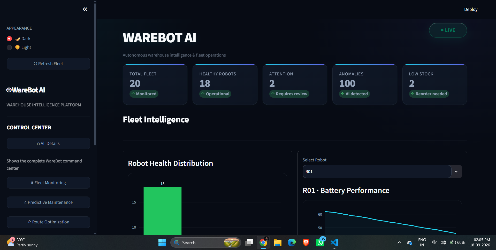

# 🤖 WareBot AI

## Real-Time Warehouse Robotics Anomaly Detection & Inventory Flow Optimization

WareBot AI is an intelligent warehouse operations platform designed to monitor autonomous warehouse robots, detect abnormal behavior, predict maintenance requirements, optimize robot task allocation and routes, and monitor warehouse inventory and orders.

---

## 🎯 Problem Statement

Modern warehouses depend on autonomous mobile robots to move inventory and fulfill orders. Robot failures, abnormal telemetry, inefficient task allocation, and warehouse congestion can cause delays and reduce operational efficiency.

WareBot AI provides a software-based warehouse intelligence system that uses robot telemetry, machine learning, route optimization, and warehouse management data to support real-time fleet operations.

---

## 🚀 Key Features

### 🛰️ Fleet Monitoring

- Real-time robot telemetry monitoring
- Battery monitoring
- Motor current monitoring
- Temperature and vibration tracking
- Navigation error monitoring
- Robot health status
- Fleet-wide robot status overview

### 🛠️ Predictive Maintenance

- Robot anomaly detection
- Maintenance risk identification
- Robot health scoring
- Critical robot identification
- Telemetry-based maintenance insights
- Battery degradation forecasting

### 🗺️ Route Optimization

- Warehouse grid simulation
- Obstacle-aware path planning
- Dynamic robot task allocation
- Target station selection
- Route distance calculation
- Optimized path generation

### 📦 Warehouse Management

- Inventory monitoring
- Product stock levels
- Reorder-level tracking
- Active order monitoring
- Order priority tracking
- Order status monitoring

### 🤖 AI Operations Assistant

- Robot health queries
- Maintenance status queries
- Anomaly information
- Fleet status assistance
- Operational insights

---

## 📊 Dashboard Modules

The WareBot AI dashboard provides a centralized warehouse operations view with the following modules.

### 🛰️ Fleet Intelligence

- Total fleet monitoring
- Healthy robot count
- Robot attention status
- Anomaly count
- Low-stock indicators
- Robot health distribution
- Individual robot battery performance
- Robot telemetry visibility

### 🛠️ Predictive Maintenance

- Robot maintenance risk
- Anomaly detection results
- Robot health indicators
- Maintenance attention alerts
- Telemetry-based risk analysis
- Critical robot identification

### 🗺️ Warehouse Digital Twin

- Live warehouse grid
- Robot positions
- Warehouse stations
- Warehouse obstacles
- Obstacle-aware navigation
- AI task allocation
- Recommended robot selection
- Target station selection
- Route distance
- Optimized path

### 🚦 Congestion Intelligence

- Robot traffic by station
- Station utilization
- Congestion monitoring
- Warehouse flow visibility
- Station activity analysis

### 📦 Warehouse Management

- Inventory table
- Product stock levels
- Reorder levels
- Active orders
- Order quantity
- Order priority
- Order status

### 🤖 Ops Assistant

- Robot health queries
- Maintenance queries
- Anomaly information
- Fleet status assistance

---

## 🧠 Machine Learning

The project demonstrates multiple AI/ML components:

- **Autoencoder** — Robot telemetry anomaly detection
- **XGBoost** — Predictive maintenance risk scoring
- **SHAP** — Explainable maintenance insights
- **LSTM** — Battery degradation forecasting
- **Classical optimization** — Robot task and route optimization

> The telemetry dataset used in this prototype is simulated for demonstrating the complete warehouse intelligence workflow.

---

## 🏗️ System Architecture

```text
Robot Telemetry
      │
      ▼
Data Processing
      │
      ├──────────────► Anomaly Detection
      │
      ├──────────────► Predictive Maintenance
      │
      └──────────────► Battery Forecasting
                              │
                              ▼
                     Warehouse Intelligence
                              │
              ┌───────────────┼───────────────┐
              ▼               ▼               ▼
       Route Optimization   WMS Data      AI Assistant
              │               │               │
              └───────────────┼───────────────┘
                              ▼
                     Streamlit Dashboard
'''

---

##📸 Dashboard Preview



---
